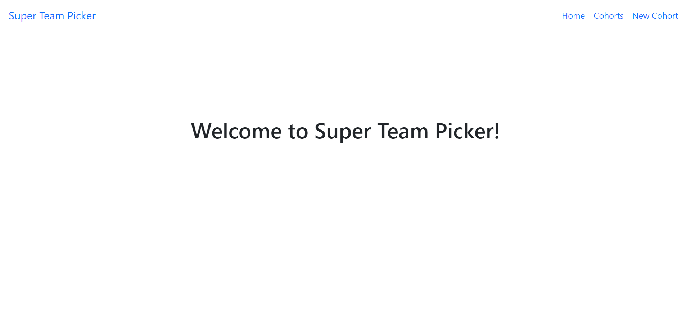
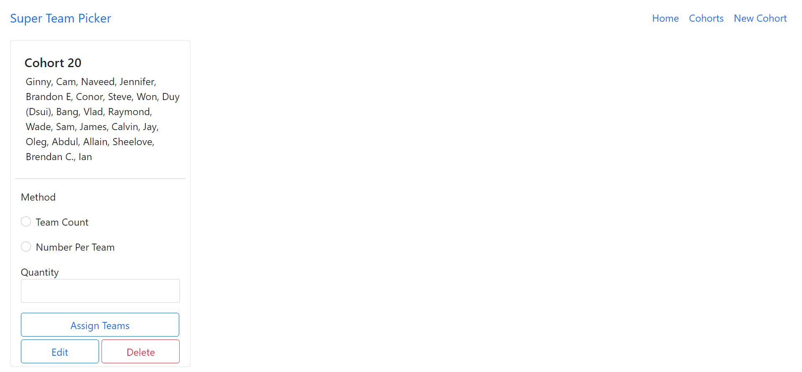
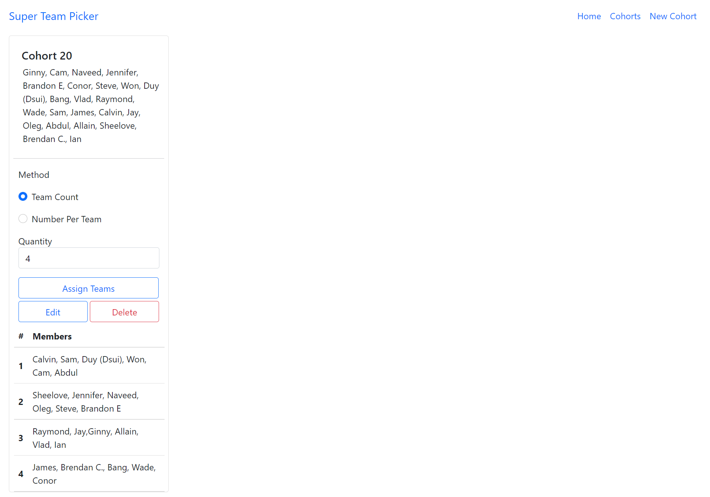

# Super Team Picker

Super Team Picker is a web application built with Node and Express that allows users to randomly generate teams based on selected methods and quantity.

## Final Product

## Dependencies
- Node.js
- Express
- EJS
- body-parser
- knex
- method-override
- morgan
- pg

## Dev Dependencies
- nodemon

## Getting Started
- Install all dependencies using the 'npm' command
### Run the server 
- Using node index.js command OR
- Using node index.js localhost 3000 OR
- Using 'npm start' by adding "start": "nodemon" to "scripts" in package.json

# File Structure

## Server and Router
- index.js
- cohorts.js
- assign.js

## Views
- footer.js
- formInput.ejs
- header.ejs
- edit.ejs
- index.ejs
- new.ejs
- show.ejs
- home.ejs